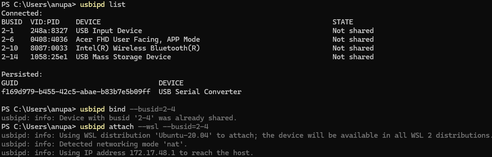
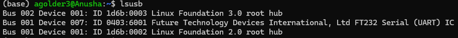
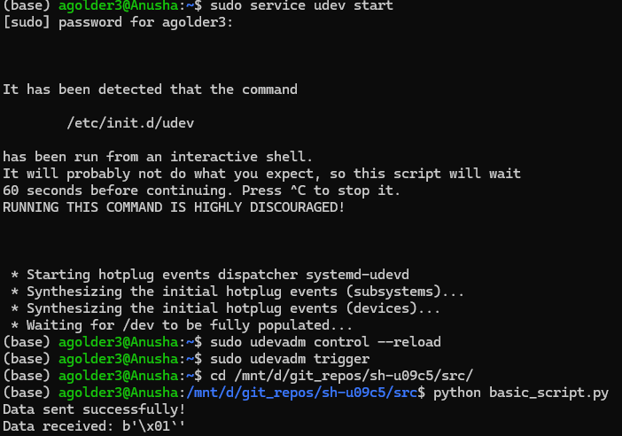

# sh-u09c5

## Device Link
[Amazon](https://www.amazon.com/DSD-TECH-SH-U09C5-Converter-Support/dp/B07WX2DSVB)

## Setting up SH-U09C5 Access from WSL:
* Install usbipd from [usbipd-win-5.0.0](https://github.com/dorssel/usbipd-win/releases/tag/v5.0.0)
* Open Windows Powershell with Run as Administrator
* List usb devices: ```usbipd list```
* Bind the device: ```usbipd bind --busid=<BUSID>```
* Connect the device: ```usbipd attach --wsl --busid=<BUSID>```
* Open WSL and run: ```lsusb```



## Using from python:
* Install pyusb: ```pip install pyusb```
* Add line to udev file: ```sudo echo 'SUBSYSTEM=="usb", ATTR{idVendor}=="0403", ATTR{idProduct}=="6001", MODE="0666"' >> /etc/udev/rules.d/99-usb.rules```
* Start udev: ```sudo service udev start```
* Load rules: ```sudo udevadm control --reload```
* Trigger: ```sudo udevadm trigger```
* Run script: ```python3 basic_script.py```
